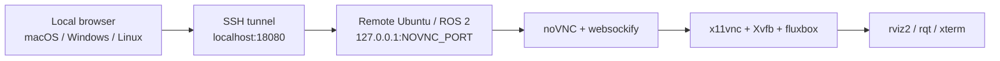

# ros2-web-desktop | Ubuntu / ROS 2 noVNC Remote Desktop (No X11 Forwarding)

<p align="left">
  <a href="README.md"></a>
  <a href="README.en.md"></a>
  <a href="https://github.com/lizuju/ros2-web-desktop/releases/latest"></a>
  
</p>

`ros2-web-desktop` lets users view and operate ROS 2 GUI tools such as `rviz2`, `rqt`, `rqt_graph`, `rqt_image_view`, and a graphical terminal from a browser on **macOS, Windows, or Linux**, with **no SSH X11 forwarding**.

The GUI applications run on the remote Ubuntu / ROS 2 device. The local computer only receives a browser-based noVNC desktop and does not need ROS 2, RViz, rqt, Docker, XQuartz, or a native VNC client.

<p align="center">
  
</p>

If this project helps you, a GitHub Star is appreciated: <https://github.com/lizuju/ros2-web-desktop>

## Why It Helps

- View RViz2, rqt, and other ROS GUI tools from a remote Ubuntu / ROS 2 device in a browser on Apple Silicon Mac, Windows, or Linux, without X11 forwarding.
- Let users inspect robot state, topics, tf, maps, point clouds, and GUI tools without installing ROS locally.
- Access noVNC through an SSH tunnel by default, so the remote device noVNC port is not exposed directly to the LAN.

## Architecture



## Remote Device Requirements

- Ubuntu with ROS 2 installed
- SSH enabled
- `sudo apt-get` access
- the robot workspace `install/setup.bash` path, if custom messages, launch files, or robot packages are needed

## Local Computer Requirements

macOS / Linux / Windows are all supported.

The local computer only needs:

- a browser
- the `ssh` command
- network access to the remote Ubuntu / ROS 2 device

Windows users can use PowerShell or Windows Terminal. If `ssh` is missing, enable OpenSSH Client.

## Quick Start

### 1. First-Time Setup on the Remote Device

For normal users, download the Release archive. Git is not required:

```bash
wget https://github.com/lizuju/ros2-web-desktop/releases/download/v0.1.4/ros2-web-desktop.tar.gz
tar -xzf ros2-web-desktop.tar.gz
cd ros2-web-desktop
./scripts/setup-ros2-novnc-system.sh
```

For development or source updates, use Git clone:

```bash
git clone -b ros2-humble https://github.com/lizuju/ros2-web-desktop.git
cd ros2-web-desktop
./scripts/setup-ros2-novnc-system.sh
```

The setup script will:

- create `.env`
- ask for `ROS_DOMAIN_ID`
- ask for the robot workspace setup file, such as `/home/<user>/<robot_ws>/install/setup.bash`
- suggest uncommon free ports, usually starting from `31880` and `31901`
- validate port values and avoid occupied/conflicting ports
- install noVNC, Xvfb, x11vnc, fluxbox, xterm, and related dependencies
- print the doctor, start, and SSH tunnel commands

Prompt guidance:

```text
ROS_DOMAIN_ID:
  Use the same ROS 2 domain ID as the robot. If unsure, start with 0.

Absolute robot workspace setup file:
  Enter the absolute setup path if the robot workspace needs sourcing.
  Example: /home/<user>/<robot_ws>/install/setup.bash
  Press Enter if not needed.

noVNC web port:
  The remote device noVNC web port. Press Enter to accept the suggested free port.

Internal VNC backend port:
  The remote device internal VNC backend port. Press Enter to accept the suggested free port.
```

### 2. Check the Remote Device

After first-time setup, or whenever a connection fails, run:

```bash
cd ~/ros2-web-desktop
./scripts/doctor-ros2-novnc-system.sh
```

`doctor` only checks ROS 2, dependencies, ports, DISPLAY, and noVNC status. It does not start `rviz2` and does not add GPU load on the remote device. If you see `FAIL`, follow the printed suggestion. `WARN` usually means the service has not been started yet.

### 3. Start on the Remote Device

```bash
cd ~/ros2-web-desktop
./scripts/start-ros2-novnc-system.sh
```

Keep this terminal open. When you see output like this, the remote side is running:

```text
noVNC is listening on port 31880
Secure mode is enabled. Use SSH tunnel, then open http://localhost:31880/vnc.html
Press Ctrl+C here to stop it.
```

Do not open the printed `localhost:31880` directly from your local browser. That address is local to the remote device. Open an SSH tunnel from the local computer first.

### 4. Open an SSH Tunnel from the Local Computer

Use the project helper when possible. It reads `NOVNC_PORT` from remote `~/ros2-web-desktop/.env`, chooses a free local port starting from `18080`, and opens the browser after the tunnel is ready.

macOS / Linux:

```bash
./scripts/open-ros2-novnc-tunnel.sh <device-user>@<device-host>
```

Windows PowerShell:

```powershell
.\scripts\open-ros2-novnc-tunnel.ps1 <device-user>@<device-host>
```

If the remote project is not in `~/ros2-web-desktop`, set the directory:

```bash
REMOTE_PROJECT_DIR=/path/to/ros2-web-desktop ./scripts/open-ros2-novnc-tunnel.sh <device-user>@<device-host>
```

You can also run the SSH tunnel manually:

```bash
ssh -N -L 18080:127.0.0.1:<NOVNC_PORT> <device-user>@<device-host>
```

If setup printed `NOVNC_PORT=31880`, the command looks like:

```bash
ssh -N -L 18080:127.0.0.1:31880 <device-user>@<device-host>
```

After entering the remote device user's password, the terminal will stay open. That is expected. Do not close it.

### 5. Open the Browser

If the browser does not open automatically, open the URL printed by the tunnel helper, for example:

```text
http://localhost:18080/vnc.html
```

Click **Connect** to enter the remote ROS 2 graphical desktop.

## Common Commands

Run these inside the browser desktop terminal:

```bash
ros2 topic list
ros2 node list
rviz2
rqt
rqt_graph
rqt_image_view
```

These commands run on the remote device, and GUI windows appear inside the browser noVNC desktop.

## Terminal Usage

The browser desktop opens an `xterm` terminal by default. It is a real terminal on the remote device, so you can run `ros2` commands, start `rviz2` / `rqt`, and open more terminal windows.

Open another terminal:

```bash
xterm &
```

You can also set the title and position:

```bash
xterm -title "ROS terminal 2" -geometry 132x36+80+80 &
```

The `&` starts the new window in the background, so the current terminal remains usable. The same pattern works for GUI tools:

```bash
rviz2 &
rqt &
```

## Port Reference

SSH tunnel format:

```bash
ssh -N -L local-port:127.0.0.1:remote-device-port user@device-address
```

Example:

```bash
ssh -N -L 18080:127.0.0.1:31880 <device-user>@<device-host>
```

- `18080` is the local computer port. Open `localhost:18080` in the browser.
- `31880` is the remote device noVNC port. Setup writes it to `.env` as `NOVNC_PORT`.
- Neither port is fixed. If local port `18080` is occupied, use another local port such as `18081`.

Example with local port `18081`:

```bash
ssh -N -L 18081:127.0.0.1:31880 <device-user>@<device-host>
```

Then open:

```text
http://localhost:18081/vnc.html
```

## Change Configuration

Edit `.env` on the remote device:

```bash
cd ~/ros2-web-desktop
nano .env
```

Common settings:

```bash
ROS_DOMAIN_ID=7
ROS_SETUP=/home/<user>/<robot_ws>/install/setup.bash
NOVNC_LISTEN_HOST=127.0.0.1
NOVNC_PORT=31880
VNC_PORT=31901
```

Restart after changing `.env`:

```bash
./scripts/start-ros2-novnc-system.sh
```

## Direct LAN Access

Direct LAN access is disabled by default. If you intentionally want other machines on the same LAN to open the remote device URL directly, set this in `.env`:

```bash
NOVNC_LISTEN_HOST=0.0.0.0
```

Restart the service, then open:

```text
http://<device-host>:<NOVNC_PORT>/vnc.html
```

Warning: anyone on the trusted LAN who knows the address and port may be able to access the desktop.

## Stop the Service

Press this in the remote device terminal running `start-ros2-novnc-system.sh`:

```text
Ctrl+C
```

If ports remain occupied after an abnormal exit, use the project stop script:

```bash
cd ~/ros2-web-desktop
./scripts/stop-ros2-novnc-system.sh
```

The script checks only this project's `websockify`, `x11vnc`, and related processes on the configured `NOVNC_PORT` / `VNC_PORT`, so it does not blindly kill unrelated services.

## Troubleshooting

**Why not SSH X11 forwarding?**

X11 forwarding can lag with RViz2, point clouds, maps, and cross-platform setups, especially on Apple Silicon Macs. This project keeps the GUI on the remote device and streams only a browser desktop to the local computer.

**The page does not open, or it stays on Connecting.**

```bash
cd ~/ros2-web-desktop
./scripts/doctor-ros2-novnc-system.sh
```

This is usually caused by a stopped remote service, a port conflict, or a missing SSH tunnel. Check `doctor`, then restart `./scripts/start-ros2-novnc-system.sh`.

**How should I choose ports?**

`NOVNC_PORT` and `VNC_PORT` are remote device ports. Setup suggests free ports automatically. If local `18080` is busy, the tunnel helper chooses the next free local port.

**What does the local computer need?**

Only a browser and the `ssh` command. macOS / Linux include it by default. On Windows, use PowerShell or Windows Terminal with OpenSSH Client enabled.

**Does Windows work?**

Yes. Run `.\scripts\open-ros2-novnc-tunnel.ps1 <device-user>@<device-host>`, then open the URL printed by the script.

**What is the advantage over Foxglove?**

It shows the native RViz2 / rqt desktop running on the remote device, so existing ROS GUI workflows do not need to be rebuilt as new visualization panels.

**What is the advantage over ToDesk-style remote desktop tools?**

It is focused on ROS 2 GUI tools over SSH tunnels, needs no local remote-desktop client, and does not expose a desktop service to the LAN by default.

**RViz2 cannot see robot topics.**

Check that `ROS_DOMAIN_ID` in `.env` matches the robot, verify `ROS_SETUP`, then run `ros2 topic list` inside the browser terminal.
