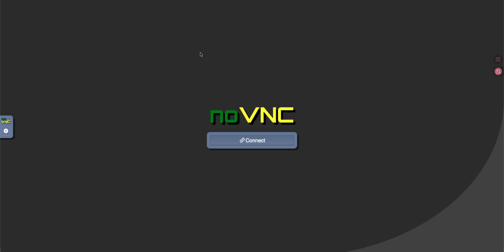
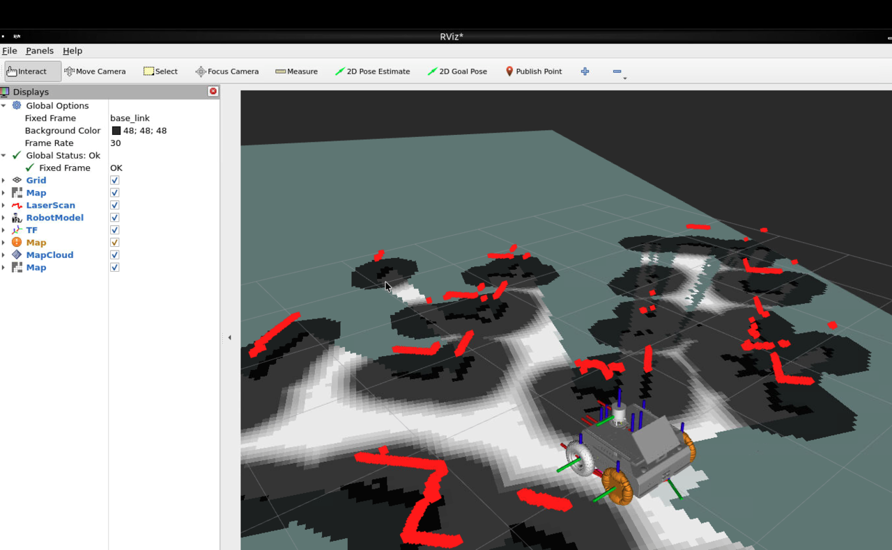

# vnc-ros | Jetson noVNC ROS 2 远程桌面

<p align="left">
  <a href="README.md"></a>
  <a href="README.en.md"></a>
</p>

`vnc-ros` 可以让用户在 **macOS、Windows、Linux** 的浏览器里查看和操作远程 Jetson 上的 ROS 2 图形工具，例如 `rviz2`、`rqt`、`rqt_graph`、`rqt_image_view` 和图形终端。

图形程序实际运行在 Jetson 上，本地电脑只接收 noVNC 网页画面，因此不需要 SSH X11 转发，也不需要在本地安装 ROS 2、RViz、rqt、Docker、XQuartz 或 VNC 客户端。





## 适合解决什么问题

- 在 Mac Apple Silicon、Windows 或 Linux 电脑上通过浏览器查看 Jetson 的 RViz2、rqt 等 ROS 图形界面，避免 X11 转发卡顿。
- 让使用者无需配置本地 ROS 环境，也能快速查看机器人状态、topic、tf、地图、点云等。
- 通过 SSH 隧道访问 noVNC，默认不把 Jetson 的 noVNC 端口暴露给局域网。

## 工作方式

Jetson 上启动一个轻量虚拟桌面：

- `Xvfb` 提供虚拟显示器
- `fluxbox` 提供窗口管理器
- `x11vnc` 把虚拟桌面变成 VNC
- `websockify` / noVNC 把 VNC 变成浏览器页面
- `rviz2`、`rqt` 等程序在 Jetson 本机运行

默认安全模式下，noVNC 只监听 Jetson 的 `127.0.0.1`。本地电脑通过 SSH 隧道访问：

```text
本地浏览器 -> localhost:18080 -> SSH 隧道 -> Jetson 127.0.0.1:<NOVNC_PORT>
```

## Jetson 端要求

- Ubuntu，并已安装 ROS 2，通常是 Ubuntu 22.04 + ROS 2 Humble
- 已开启 SSH
- 当前用户可以执行 `sudo apt-get`
- 如果机器人有自定义消息或 launch 文件，需要知道工作区的 `install/setup.bash` 绝对路径

## 本地电脑要求

macOS / Linux / Windows 均可使用。

本地电脑只需要：

- 浏览器
- `ssh` 命令
- 能通过网络访问 Jetson

Windows 用户可以使用 PowerShell 或 Windows Terminal。若系统没有 `ssh`，需要启用 OpenSSH Client。

## 快速上手

### 1. Jetson 第一次安装配置

在 Jetson 上运行：

```bash
git clone -b ros2-humble https://github.com/lizuju/vnc-ros.git
cd vnc-ros
./scripts/setup-jetson-novnc-system.sh
```

安装脚本会自动：

- 创建 `.env`
- 询问 `ROS_DOMAIN_ID`
- 询问机器人工作区 setup 文件路径，例如 `/home/<user>/<robot_ws>/install/setup.bash`
- 自动推荐不常见且未占用的端口，通常从 `31880` 和 `31901` 开始找
- 检查端口是否有效、是否被占用、两个端口是否冲突
- 安装 noVNC、Xvfb、x11vnc、fluxbox、xterm 等依赖
- 最后输出本地电脑需要执行的 SSH 隧道命令

提示项说明：

```text
ROS_DOMAIN_ID:
  填机器人 ROS 2 使用的 domain id。不确定时先用 0。

Absolute robot workspace setup file:
  如果机器人工作区需要 source，填写绝对路径。
  例如 /home/<user>/<robot_ws>/install/setup.bash
  不需要则直接回车。

noVNC web port:
  Jetson 上的 noVNC 网页端口。建议直接回车使用推荐值。

Internal VNC backend port:
  Jetson 内部 VNC 后端端口。建议直接回车使用推荐值。
```

### 2. Jetson 每次启动

```bash
cd ~/vnc-ros
./scripts/start-jetson-novnc-system.sh
```

保持这个终端不要关闭。看到类似输出后说明 Jetson 端已启动：

```text
noVNC is listening on port 31880
Secure mode is enabled. Use SSH tunnel, then open http://localhost:31880/vnc.html
Press Ctrl+C here to stop it.
```

注意：这里的 `localhost:31880` 是 Jetson 自己的本地地址，不是你本地电脑的浏览器地址。本地电脑需要先开 SSH 隧道。

### 3. 本地电脑打开 SSH 隧道

在 macOS、Linux 或 Windows PowerShell 中运行：

```bash
ssh -N -L 18080:127.0.0.1:<NOVNC_PORT> <jetson-user>@<jetson-ip>
```

如果 setup 脚本输出的 `NOVNC_PORT` 是 `31880`，命令类似：

```bash
ssh -N -L 18080:127.0.0.1:31880 <jetson-user>@<jetson-ip>
```

输入 Jetson 密码后，终端停住是正常的。保持这个终端不要关闭。

### 4. 浏览器访问

打开：

```text
http://localhost:18080/vnc.html
```

点击 **Connect** 后即可进入 Jetson 图形桌面。

## 常用命令

在网页桌面的终端里运行：

```bash
ros2 topic list
ros2 node list
rviz2
rqt
rqt_graph
rqt_image_view
```

这些命令都在 Jetson 上执行，图形窗口会显示在浏览器 noVNC 桌面里。

## 端口说明

SSH 隧道格式：

```bash
ssh -N -L 本地端口:127.0.0.1:Jetson端口 用户名@Jetson地址
```

例如：

```bash
ssh -N -L 18080:127.0.0.1:31880 <jetson-user>@<jetson-ip>
```

- `18080` 是本地电脑端口，浏览器打开 `localhost:18080`。
- `31880` 是 Jetson noVNC 端口，由 setup 脚本写入 `.env` 的 `NOVNC_PORT`。
- 两个端口都不是固定值。如果本地 `18080` 被占用，可以换成 `18081`。

本地端口换成 `18081` 的例子：

```bash
ssh -N -L 18081:127.0.0.1:31880 <jetson-user>@<jetson-ip>
```

浏览器打开：

```text
http://localhost:18081/vnc.html
```

## 修改配置

在 Jetson 上编辑 `.env`：

```bash
cd ~/vnc-ros
nano .env
```

常见配置：

```bash
ROS_DOMAIN_ID=7
JETSON_ROS_SETUP=/home/<user>/<robot_ws>/install/setup.bash
NOVNC_LISTEN_HOST=127.0.0.1
NOVNC_PORT=31880
VNC_PORT=31901
```

修改后重启：

```bash
./scripts/start-jetson-novnc-system.sh
```

## 直接局域网访问

默认不建议直接暴露 noVNC 到局域网。如果确实需要同一局域网用户直接打开 Jetson 地址，可以在 `.env` 中设置：

```bash
NOVNC_LISTEN_HOST=0.0.0.0
```

然后重启服务，浏览器打开：

```text
http://<jetson-ip>:<NOVNC_PORT>/vnc.html
```

注意：这样同一局域网中知道地址和端口的人都可能打开桌面。只在可信网络中使用。

## 停止服务

在运行 `start-jetson-novnc-system.sh` 的 Jetson 终端按：

```text
Ctrl+C
```

如果异常退出后端口仍被占用：

```bash
pkill -f websockify || true
pkill -f x11vnc || true
pkill -f Xvfb || true
```

## 常见问题

页面打不开：

```bash
cd ~/vnc-ros
ss -lntp | grep -E ':31880|:31901|:5900' || true
tail -n 80 logs/novnc.log logs/x11vnc.log logs/xvfb.log
```

页面能打开但点击 Connect 失败：

- 通常是后端 VNC 端口冲突
- 修改 `.env` 里的 `VNC_PORT`
- 重启 `./scripts/start-jetson-novnc-system.sh`

`rviz2` 看不到机器人 topic：

- 检查 `ROS_DOMAIN_ID` 是否和机器人一致
- 检查 `JETSON_ROS_SETUP` 是否指向正确工作区
- 在网页终端里运行 `ros2 topic list`

本地 `ssh -L` 提示 `Address already in use`：

- 换一个本地端口，例如从 `18080` 改成 `18081`
- 浏览器也对应打开 `http://localhost:18081/vnc.html`

## 相关文档

- [QUICKSTART.md](QUICKSTART.md)
- [LOCAL_TUNNEL.md](LOCAL_TUNNEL.md)
- [JETSON_NOVNC.md](JETSON_NOVNC.md)
- [DISTRIBUTING_JETSON_NOVNC.md](DISTRIBUTING_JETSON_NOVNC.md)
