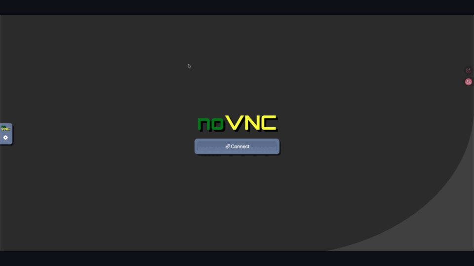
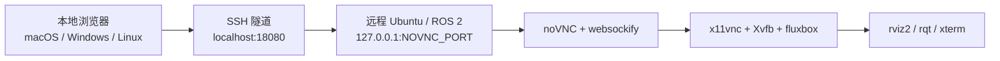

# ros2-web-desktop | Ubuntu / ROS 2 noVNC 远程桌面（无需 X11 转发）

<p align="left">
  <a href="README.md"></a>
  <a href="README.en.md"></a>
  <a href="https://github.com/lizuju/ros2-web-desktop/releases/latest"></a>
  
</p>

`ros2-web-desktop` 可以在 **macOS、Windows、Linux** 的浏览器里查看和操作远程 Ubuntu / ROS 2 设备上的 `rviz2`、`rqt`、`rqt_graph`、`rqt_image_view` 和图形终端，**无需 SSH X11 转发**。

图形程序运行在远程设备上，本地电脑只接收 noVNC 网页画面。本地不需要安装 ROS 2、RViz、rqt、Docker、XQuartz 或 VNC 客户端。

<p align="center">
  
</p>

如果项目对你有帮助，欢迎 Star：<https://github.com/lizuju/ros2-web-desktop>

## 核心价值

- 在 Mac Apple Silicon、Windows 或 Linux 电脑上通过浏览器查看远程 Ubuntu / ROS 2 设备的 RViz2、rqt 等图形界面，无需 X11 转发。
- 让使用者无需配置本地 ROS 环境，也能快速查看机器人状态、topic、tf、地图、点云等。
- 通过 SSH 隧道访问 noVNC，默认不把远程设备的 noVNC 端口暴露给局域网。

## 架构



## 远程设备要求

- Ubuntu，并已安装 ROS 2
- 已开启 SSH
- 当前用户可以执行 `sudo apt-get`
- 如果机器人有自定义消息或 launch 文件，需要知道工作区的 `install/setup.bash` 绝对路径

## 本地电脑要求

macOS / Linux / Windows 均可使用。

本地电脑只需要：

- 浏览器
- `ssh` 命令
- 能通过网络访问远程 Ubuntu / ROS 2 设备

Windows 用户可以使用 PowerShell 或 Windows Terminal。若系统没有 `ssh`，需要启用 OpenSSH Client。

## 快速上手

### 1. 远程设备第一次安装配置

普通用户可以直接下载 Release 压缩包，不需要安装 Git：

```bash
wget https://github.com/lizuju/ros2-web-desktop/releases/download/v0.1.8/ros2-web-desktop.tar.gz
tar -xzf ros2-web-desktop.tar.gz
cd ros2-web-desktop
./scripts/setup-ros2-novnc-system.sh
```

如果要参与开发或同步源码，也可以用 Git clone：

```bash
git clone -b ros2-humble https://github.com/lizuju/ros2-web-desktop.git
cd ros2-web-desktop
./scripts/setup-ros2-novnc-system.sh
```

安装脚本会自动：

- 创建 `.env`
- 询问 `ROS_DOMAIN_ID`
- 询问机器人工作区 setup 文件路径，例如 `/home/<user>/<robot_ws>/install/setup.bash`
- 自动推荐不常见且未占用的端口，通常从 `31880` 和 `31901` 开始找
- 检查端口是否有效、是否被占用、两个端口是否冲突
- 安装 noVNC、Xvfb、x11vnc、fluxbox、xterm 等依赖
- 最后输出自检、状态、启动和 SSH 隧道命令

提示项说明：

```text
ROS_DOMAIN_ID:
  填机器人 ROS 2 使用的 domain id。不确定时先用 0。

Absolute robot workspace setup file:
  如果机器人工作区需要 source，填写绝对路径。
  例如 /home/<user>/<robot_ws>/install/setup.bash
  不需要则直接回车。

noVNC web port:
  远程设备上的 noVNC 网页端口。建议直接回车使用推荐值。

Internal VNC backend port:
  远程设备内部 VNC 后端端口。建议直接回车使用推荐值。
```

### 2. 远程设备自检

第一次配置后，或连接异常时，先运行：

```bash
cd ~/ros2-web-desktop
./scripts/doctor-ros2-novnc-system.sh
```

`doctor` 只检查 ROS 2、依赖、端口、DISPLAY 和 noVNC 状态，不启动 `rviz2`，也不会增加远程设备的 GPU 负载。看到 `FAIL` 时，按输出的建议处理；只有 `WARN` 通常表示服务还没启动。

查看 noVNC / x11vnc / Xvfb 当前是否运行：

```bash
./scripts/status-ros2-novnc-system.sh
```

### 3. 远程设备每次启动

```bash
cd ~/ros2-web-desktop
./scripts/start-ros2-novnc-system.sh
```

保持这个终端不要关闭。看到类似输出后说明远程设备端已启动：

```text
noVNC is listening on port 31880
Secure mode is enabled. Use SSH tunnel, then open http://localhost:31880/vnc.html
Press Ctrl+C here to stop it.
```

注意：这里的 `localhost:31880` 是远程设备自己的本地地址，不是你本地电脑的浏览器地址。本地电脑需要先开 SSH 隧道。

### 4. 本地电脑打开 SSH 隧道

推荐使用项目自带脚本。它会从远程 `~/ros2-web-desktop/.env` 自动读取 `NOVNC_PORT`，从 `18080` 开始自动选择本地未占用端口，并在隧道就绪后打开浏览器。

macOS / Linux：

```bash
./scripts/open-ros2-novnc-tunnel.sh <device-user>@<device-host>
```

Windows PowerShell：

```powershell
.\scripts\open-ros2-novnc-tunnel.ps1 <device-user>@<device-host>
```

如果远程项目不在 `~/ros2-web-desktop`，可以指定路径：

```bash
REMOTE_PROJECT_DIR=/path/to/ros2-web-desktop ./scripts/open-ros2-novnc-tunnel.sh <device-user>@<device-host>
```

也可以手动运行 SSH 隧道：

```bash
ssh -N -L 18080:127.0.0.1:<NOVNC_PORT> <device-user>@<device-host>
```

如果 setup 脚本输出的 `NOVNC_PORT` 是 `31880`，命令类似：

```bash
ssh -N -L 18080:127.0.0.1:31880 <device-user>@<device-host>
```

输入远程设备用户密码后，终端停住是正常的。保持这个终端不要关闭。

### 5. 浏览器访问

如果没有自动打开浏览器，手动打开脚本输出的地址，例如：

```text
http://localhost:18080/vnc.html
```

点击 **Connect** 后即可进入远程 ROS 2 图形桌面。

## 常用命令

在网页桌面的终端里运行：

```bash
ros2 topic list
ros2 node list
rviz2
rqt
rqt_graph
rqt_image_view
```

这些命令都在远程设备上执行，图形窗口会显示在浏览器 noVNC 桌面里。

## 终端操作

网页桌面默认会打开一个 `xterm` 终端。它是远程设备上的真实终端，可以执行 `ros2` 命令、启动 `rviz2` / `rqt`，也可以多开终端窗口。

新开一个终端：

```bash
xterm &
```

也可以指定标题和位置：

```bash
xterm -title "ROS terminal 2" -geometry 132x36+80+80 &
```

`&` 表示后台启动新窗口，当前终端不会被占用。启动图形工具时也可以用同样方式：

```bash
rviz2 &
rqt &
```

## 端口说明

SSH 隧道格式：

```bash
ssh -N -L 本地端口:127.0.0.1:远程设备端口 用户名@设备地址
```

例如：

```bash
ssh -N -L 18080:127.0.0.1:31880 <device-user>@<device-host>
```

- `18080` 是本地电脑端口，浏览器打开 `localhost:18080`。
- `31880` 是远程设备 noVNC 端口，由 setup 脚本写入 `.env` 的 `NOVNC_PORT`。
- 两个端口都不是固定值。如果本地 `18080` 被占用，可以换成 `18081`。

本地端口换成 `18081` 的例子：

```bash
ssh -N -L 18081:127.0.0.1:31880 <device-user>@<device-host>
```

浏览器打开：

```text
http://localhost:18081/vnc.html
```

## 修改配置

在远程设备上编辑 `.env`：

```bash
cd ~/ros2-web-desktop
nano .env
```

常见配置：

```bash
ROS_DOMAIN_ID=7
ROS_SETUP=/home/<user>/<robot_ws>/install/setup.bash
NOVNC_LISTEN_HOST=127.0.0.1
NOVNC_PORT=31880
VNC_PORT=31901
```

修改后重启：

```bash
./scripts/start-ros2-novnc-system.sh
```

## 直接局域网访问

默认不建议直接暴露 noVNC 到局域网。如果确实需要同一局域网用户直接打开远程设备地址，可以在 `.env` 中设置：

```bash
NOVNC_LISTEN_HOST=0.0.0.0
```

然后重启服务，浏览器打开：

```text
http://<device-host>:<NOVNC_PORT>/vnc.html
```

注意：这样同一局域网中知道地址和端口的人都可能打开桌面。只在可信网络中使用。

## 停止服务

在运行 `start-ros2-novnc-system.sh` 的远程设备终端按：

```text
Ctrl+C
```

如果异常退出后端口仍被占用，使用项目自带的停止脚本：

```bash
cd ~/ros2-web-desktop
./scripts/stop-ros2-novnc-system.sh
```

这个脚本只会按 `.env` 里的 `NOVNC_PORT` / `VNC_PORT` 和本项目 pid 文件检查 `websockify`、`x11vnc` 等进程，不会按端口号全局乱杀其它服务。停止前后可以用 `./scripts/status-ros2-novnc-system.sh` 看当前状态。

## 常见问题

**为什么不用 X11 转发？**

X11 转发在 RViz2、点云、地图这类图形界面上容易卡，尤其是 Apple Silicon Mac 和跨平台环境。本项目把图形界面留在远程设备上，本地只看浏览器画面。

**页面打不开或一直 Connecting？**

```bash
cd ~/ros2-web-desktop
./scripts/status-ros2-novnc-system.sh
./scripts/doctor-ros2-novnc-system.sh
```

通常是远程服务没启动、端口冲突，或本地 SSH 隧道没开。先用 `status` 看 noVNC / x11vnc / Xvfb 是否运行，再看 `doctor` 输出并重启 `./scripts/start-ros2-novnc-system.sh`。

**Xvfb 提示 server already running？**

通常是远程设备已有 X server 使用了 `DISPLAY=:0` / `:1`，或旧进程没有退出。项目默认使用 `.env` 里的 `DISPLAY=:99`；先运行 `./scripts/status-ros2-novnc-system.sh` 和 `./scripts/stop-ros2-novnc-system.sh`，仍冲突时把 `.env` 的 `DISPLAY` 改成未占用值，例如 `:98`。

**端口要怎么选？**

`NOVNC_PORT` 和 `VNC_PORT` 是远程设备端口，setup 会自动推荐空闲端口。本地 `18080` 被占用时，项目隧道脚本会自动换到下一个空闲端口。

**本地电脑需要安装什么？**

只需要浏览器和 `ssh` 命令。macOS / Linux 默认有；Windows 推荐用 PowerShell 或 Windows Terminal，并启用 OpenSSH Client。

**Windows 可以用吗？**

可以。使用 `.\scripts\open-ros2-novnc-tunnel.ps1 <device-user>@<device-host>` 打开 SSH 隧道，再用浏览器访问脚本输出的地址。

**和 Foxglove 比有什么优势？**

它直接显示远程设备上的原生 RViz2 / rqt 桌面，不需要把现有 ROS GUI 工作流迁移到新的可视化面板。

**和 ToDesk 这类远程桌面比有什么优势？**

它只面向 ROS 2 图形工具和 SSH 隧道场景，本地无需安装远程桌面客户端，也默认不把桌面服务暴露到局域网。

**RViz2 看不到机器人 topic？**

检查 `.env` 里的 `ROS_DOMAIN_ID` 是否和机器人一致，`ROS_SETUP` 是否指向正确工作区，然后在网页终端里运行 `ros2 topic list`。
